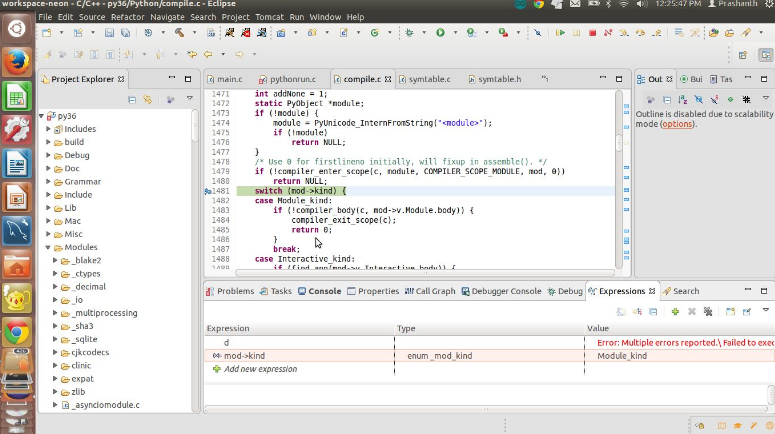
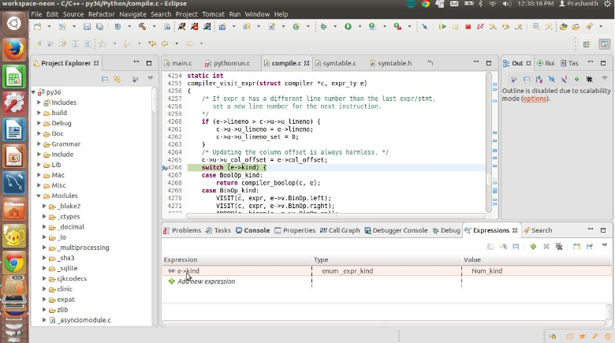

<h1 align="center"> Chapter 5</h1>
<h1 align="center"> Debugging the compiler and code generator</h1>

Let us come back to the function Python/compile.c on line number 341 which is a call the function compiler_mod. Let us step into the function which is defined in the same file on line number 1468. Insert a breakpoint on line number 1481 and observe the kind of the module.




It is of type Module_kind and hence the debugger gets trapped on line number 1483. Into this there is a call to the function compiler_body which is defined in the same file on line number 1434. Let us step into this function and insert a breakpoint on line number 1462 which contains the following code:

```C
for (; i < asdl_seq_LEN(stmts); i++)
	VISIT(c, stmt, (stmt_ty)asdl_seq_GET(stmts, i));
``` 

Here we observe that we iterate through the asdl statements and call the macro VISIT.  Which inturn calls the function compiler_visit_stmt which is defined in the same file on line number 2073. Let us insert a breakpoint on line number 2081 and check the type of the statement.


Let us insert a breakpoint on line number 2831. On line number we again call the macro with the type expr therefore the function compiler_visit_expr is called. Let us insert a debug point on line number 2968 and observe the kind of expression.



We see that it is of the kind Num_kind therefore let us insert a breakpoint on line number 4338. We observe there is a call to the macro ADDOP_O. Let us step into the macro which internally calls the function compiler_addop_o. It internally calls the function compiler_addop_i. Let us insert a breakpoint on line number 1153 and observe the value of the generated opcode.

We see that the value is 100. The values of these opcodes are defined in the file
Include/opcode.h.

To verify if we have generated the right opcode. On the file test.py execute the following
command.

```bash
$python -m dis test.py


  1           0 LOAD_CONST               0 (100)

              3 STORE_NAME               0 (a)

              6 LOAD_CONST               1 (None)

              9 RETURN_VALUE
```

From this we can verify that our generated bytecode is correct.
I would suggest you to debug larger programs and see how the opcode is generated for the same. Adios :)

