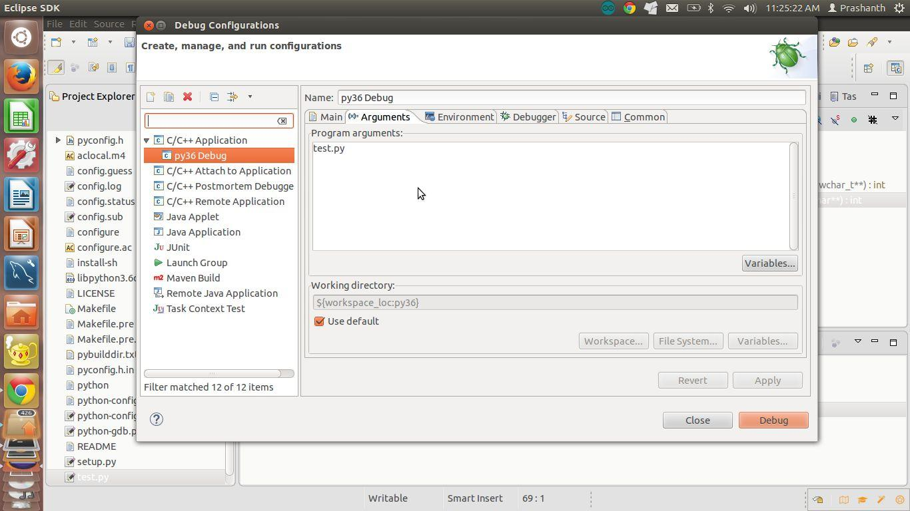
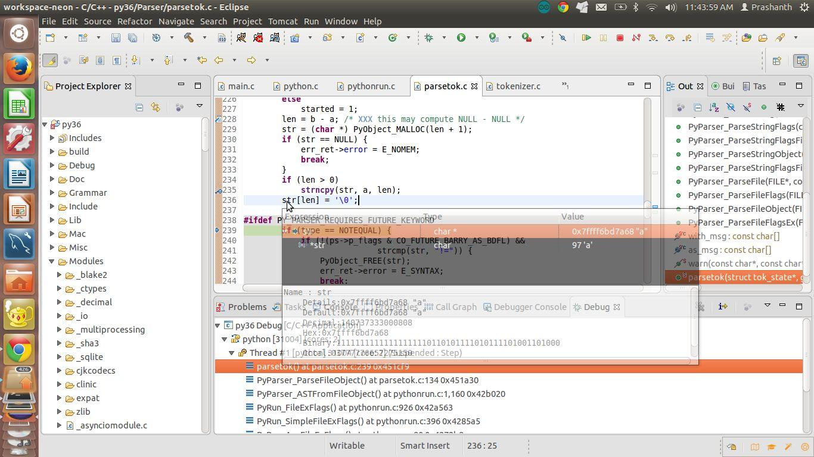
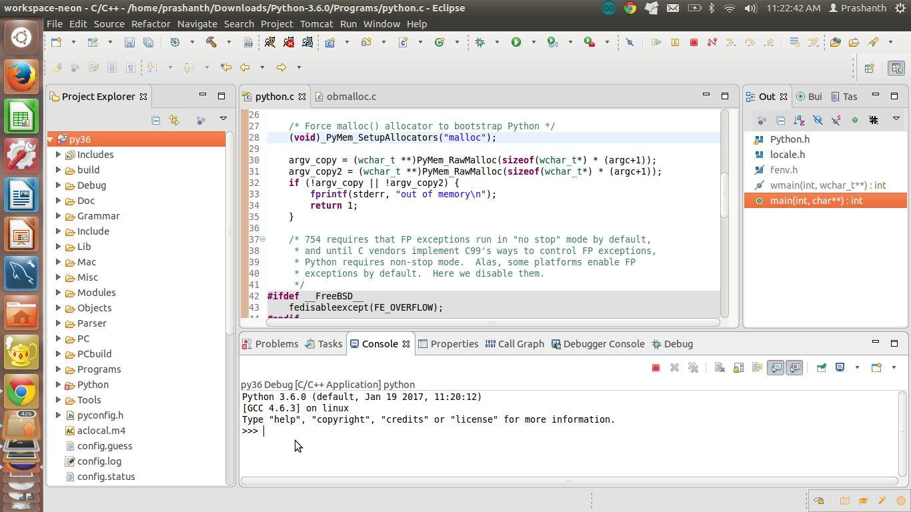
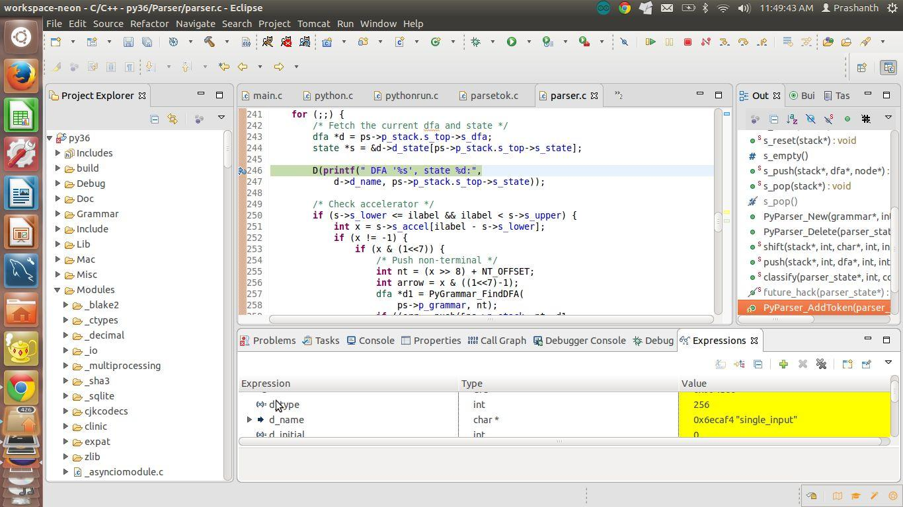
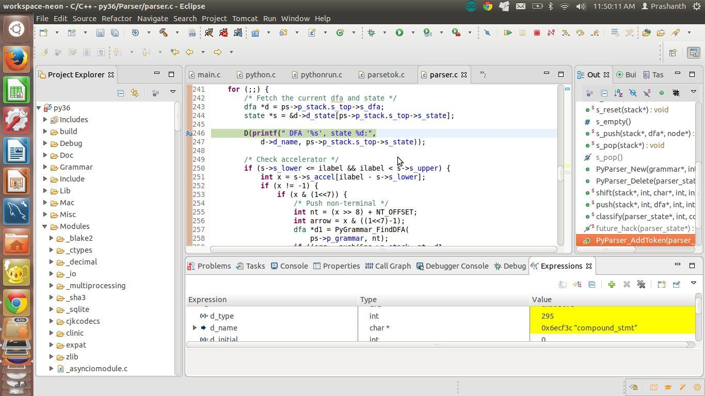
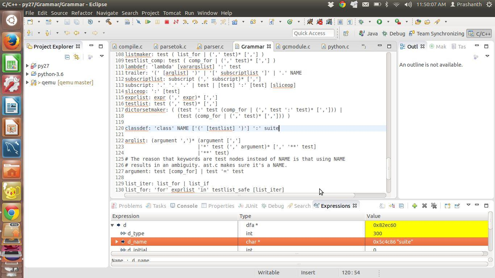

# Chapter 2
### Debugging the parser
**2.1 Debugging the parser**

Before we set into looking into how the python parser works let us create a sample python file
called test.py in root folder of python source with the following contents.
```c
a=100
```
To your debugging configuration in eclipse pass the argument as test.py



Open the file Modules/python.c and observe the main function of python. It is a simple call to the
function Py_Main defined in the file Modules/main.c.
Let us start debugging this function. In the initial lines we see that the appropriate flags are set
depending on the command line arguments passed.
The important code lies in line number 780 in the file Modules/main.c which is a call to the
function run_file with the file pointer and file name as arguments.

```c
sts = run_file(fp, filename, &cf);
```

This internally calls the function PyRun_AnyFileExFlags in the same file on line number 320.

```c
sts = PyRun_AnyFileExFlags(fp, filename == NULL ? "<stdin>" : filename, filename != NULL, &cf)
!= 0;
```

Let us insert a breakpoint in line no 320 and step into the function which is in the file
Python/pythonrun.c

In this function we observe that there are 2 path flows depending on whether we are running
python as a interactive mode or as a program. In this book we will be initially demonstrating the
program mode and later shift to the interactive mode in the later parts of the book.

```c
int
PyRun_AnyFileExFlags(FILE *fp, const char *filename, int closeit,
             PyCompilerFlags *flags)
{
if (filename == NULL)
  filename = "???";
if (Py_FdIsInteractive(fp, filename)) {
  int err = PyRun_InteractiveLoopFlags(fp, filename, flags);
  if (closeit)
     fclose(fp);
  return err;
}
else
  return PyRun_SimpleFileExFlags(fp, filename, closeit, flags);
}
```

Insert a breakpoint in line number 80 which is a call to the function PyRun_SimpleFileExFlags.
Step into the function. In this function it checks if the pyc file already exists for the module using
the function maybe_pyc_file in line number 370. If the pyc file is found the interpreter is called to
execute the module. Else the function PyRun_FileExFlags is called which is defined in the same
file on line number 396.

In this function on line number 926 is the call to the function PyParser_ASTFromFileObject
which is defined in the file pythonrun.c on line number 1150. This function invokes the parser in
the function PyParser_ParseFileObject on line number 1160 and invokes the AST tree
constructor function PyAST_FromNodeObject in line number 1169. We shall cover the
construction of the AST tree in the next chapter. Let us look in deep into the function
PyParser_ParseFileObject which calls the function parsetok which is defined in the file
Parser/parsetok.c in line number 184.

In the function parsetok on line number 208 is the call to the function PyTokenizer_Get which is
defined in the file tokenizer.c in the line number 1879. This function calls the function tok_get
which is defined in the same file in line number 1363.
Let us debug this function on line number 235 and examine the value of str.



It is the value of the character ‘a’ which is 97. Let us step debug the program and move to line
number 1513 which loops through the character array in tok and computes the name of the
variable and in line number 1587 returns the value NAME to signal that the current token is a
variable name in this case. Let us debug back to the function parsetok on line number 263
which is a call to the function PyParser_AddToken. We will just for now assume that the token is
added into the parse tree at this moment. We shall dive into this aspect in the coming section on
how the grammar is built.
At this stage I would suggest you to follow the same for the other tokens ‘=’ and ‘100’ and trace
how they are added into the parse tree.


**2.2 Generation of the grammar**


The textual representation of the grammar is present in the file Grammar/Grammar. It is written
in yacc and I would suggest you to go through it. I will skip the explanation here as it is fairly
simple to do it. The numerical representation of the grammar is present in the file
Python/graminit.c which contains the array of dfa’s representing the source program. Let us now
debug how the dfas are used in construction of the parse tree. Open the source file
Parser/parser.c line number 243 which is the function PyParser_AddToken. Start debugging the
application and open the python shell in the eclipse debugger as shown below:



Add a breakpoint on line number 243 on the file parser.c.

In the debug console type the statement:

```c
>>> class c:
    pass
```
Once we enter the following class definition, we observe that the debugger gets trapped. Let us
observe the state of the dfa. It is single_input as shown below:



Run the debugger to go through the loop once again. Observe the value of the current dfa it is
compound_stmt as shown below:



Run through the debugger loop once again, we observe the value of the dfa is classdef as shown below: 




This is exactly how the dfa is defined in the file Grammar/Grammar. You can find out how the 
numerical values are mapped in the file graminit.c where the dfas are defined as an array. 
