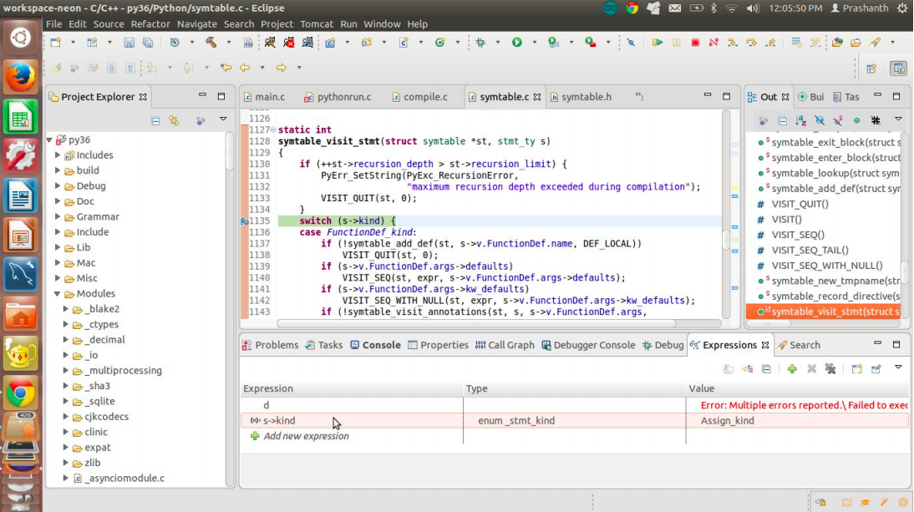

## Chapter 4

### Debugging the symbol table generator
Let us step back into the function PyRun_FileExFlags on line number 933 in the file
Python/pythonrun.c which is a call to the function run_mod. The run_mod function is defined in
the same file on line number 972. It has two principal functions to generate the code object and
second to call the interpreter loop. The generation of the code object to be run is in the function
PyAST_CompileObject on line number 977. Let us step into this function. This function is
defined in the file Python/compile.c on line number 301. It has two important functions:
1. Generate the symbol table. This is done by the function PySymtable_BuildObject
which is defined in the file Python/symtable.c on line number 240. We shall step into this
function and insert a debug point at line number 280. In this line number we observe it iterates
through the asdl_sequence for the module and generates the symbol table entry in the function
symtable_visit_stmt. Before we step into this function we need to understand the structures that
support the symbol table. They are defined in the file Include/symtable.h.
```c
struct _symtable_entry;
struct symtable {
 PyObject *st_filename; /* name of file being compiled,
 decoded from the filesystem encoding */
 struct _symtable_entry *st_cur; /* current symbol table entry */
 struct _symtable_entry *st_top; /* symbol table entry for module */
 PyObject *st_blocks; /* dict: map AST node addresses
 * to symbol table entries */
 PyObject *st_stack; /* list: stack of namespace info */
 PyObject *st_global; /* borrowed ref to st_top->ste_symbols */
 int st_nblocks; /* number of blocks used. kept for
 consistency with the corresponding
 compiler structure */
 PyObject *st_private; /* name of current class or NULL */
 PyFutureFeatures *st_future; /* module's future features that affect
 the symbol table */
 int recursion_depth; /* current recursion depth */
 int recursion_limit; /* recursion limit */
};
typedef struct _symtable_entry {
 PyObject_HEAD
 PyObject *ste_id; /* int: key in ste_table->st_blocks */
 PyObject *ste_symbols; /* dict: variable names to flags */
 PyObject *ste_name; /* string: name of current block */
 PyObject *ste_varnames; /* list of function parameters */
 PyObject *ste_children; /* list of child blocks */
 PyObject *ste_directives;/* locations of global and nonlocal statements */
 _Py_block_ty ste_type; /* module, class, or function */
 int ste_nested; /* true if block is nested */
 unsigned ste_free : 1; /* true if block has free variables */
 unsigned ste_child_free : 1; /* true if a child block has free vars,
 including free refs to globals */
 unsigned ste_generator : 1; /* true if namespace is a generator */
 unsigned ste_coroutine : 1; /* true if namespace is a coroutine */
 unsigned ste_varargs : 1; /* true if block has varargs */
 unsigned ste_varkeywords : 1; /* true if block has varkeywords */
 unsigned ste_returns_value : 1; /* true if namespace uses return with
 an argument */
 unsigned ste_needs_class_closure : 1; /* for class scopes, true if a
 closure over __class__
 should be created */
 int ste_lineno; /* first line of block */
 int ste_col_offset; /* offset of first line of block */
 int ste_opt_lineno; /* lineno of last exec or import * */
 int ste_opt_col_offset; /* offset of last exec or import * */
 int ste_tmpname; /* counter for listcomp temp vars */
 struct symtable *ste_table;
} PySTEntryObject;
 ```
 We observe that the symbol table is a dictionary containing the symbol table entries. I shall not
dwelve into explaining these individual fields as comments are added at the source code level.
Let us debug back into the function symtable_visit_stmt which is defined in Python/symtable.c
on line number 1128.
Let us insert a breakpoint on line number 1135 and observe how the debugger gets trapped.
Observe the kind of statement from the screenshot below.



Let us insert a breakpoint on line number 1056 and observe the entries into the symbol table.
We observe that there is a call to the macro VISIT_SEQ which internally calls the function
symtable_visit_expr which is defined in the same file on line number 1387. Here we observe
that the kind of expression is Name_Kind hence insert a breakpoint on line number 1501 which
calls the function symtable_add_def which basically adds a definition into the symbol table. I
would suggest you to debug this function on your own as it is quite straight forward.
### Exercise:
Trace the symbol table entries for the following python files:

1. 
```python
class test:
    pass
```
2. 
```python
l = range(0, 10)
m = map(lambda x: x*2, l)
```
In this exercise we have understood how symbol table entries are created. Kudos :).